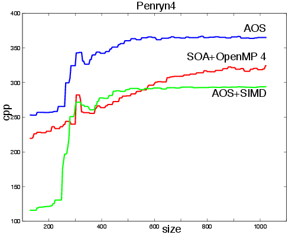
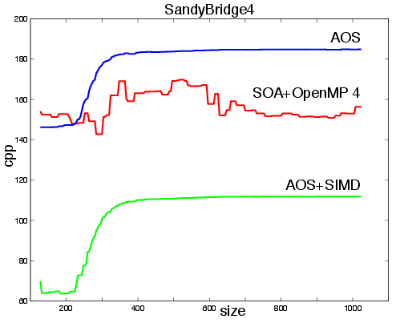

Covariance matching techniques have recently grown in interest due to their good performances for object retrieval, detection and tracking. By mixing color and texture information in a compact representation, it can be applied to various kinds of objects (textured or not, rigid or not). Unfortunately, the original version requires  heavy computations, and is difficult to execute in real-time on embedded systems. This article presents a review on different versions of the algorithm and its various applications. Then, a comprehensive study is made to reach higher level of performance on multi-core CPU architectures, by comparing different ways to structure the information, using SIMD instructions and advanced loop transformations. The execution time is reduced significantly on  two dual-core CPU architectures for embedded computing: PandaBoard with ARM Cortex-A9 and an Intel Ultra Low voltage U9300. According to our experiments on Covariance Tracking (CT), it is possible to reach a speedup of x2.2 on ARM Cortex-A9 and x2.8 on Intel U9300, when compared to the original algorithm, leading to real-time execution.

