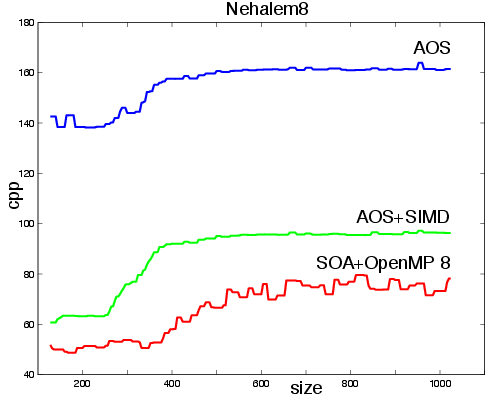
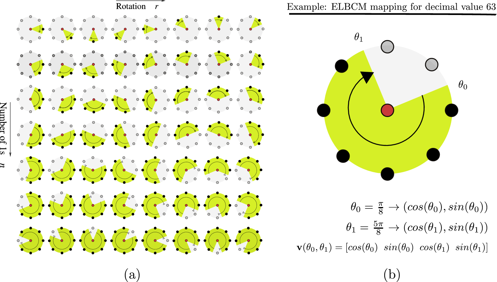

<ul class="grid effect-2" id="grid">
	<li>
		<a href="dasip2013.html">
			<b>Real-time covariance tracking algorithm for embedded systems</b>.
		</a>
		 A.&nbsp;Romero Mier&nbsp;y Ter&aacute;n, L.&nbsp;Lacassagne, A.&nbsp;Hassan&nbsp;Zahraee, and
		  Gouiff&egrave;s.
		 In <em>Conference on Design &amp; Architectures for Signal &amp; Image
		  Processing (DASIP) proceedings.</em>, number Special Issue on Real-Time Color
		  Image Processing. IEEE, 2013.
		  

		    

		      
 <a href="dasip2013.pdf" class="icon-file-text">PDF</a>

		      
<a href="slides/dasip2013_slides.pdf">Slides</a>

		    

		  

		 
	</li>
	<li>
		<a href="jrtip2013.pdf"><b>Color tracking with contextual switching: Real-time implementation on
		  CPU</b></a>
		 F.&nbsp;Laguzet, A.&nbsp;Romero Mier&nbsp;y Ter&aacute;n, M.&nbsp;Gouiff&egrave;s, and
		  L.&nbsp;Lacassagne.
		 <em>Journal of Real Time Image Processing (JRTIP)</em>, (Special Issue
		  on Real-Time Color Image Processing), 2013.<a href="jrtip2013.pdf" class="icon-file-text">PDF</a>
	</li>
	<li>
		<a href="icip2013.pdf"><b>Total Bregman Divergence for Multiple Object Tracking.</b></a>
		 A.&nbsp;Romero, M.&nbsp;Gouiff&egrave;s, and L.&nbsp;Lacassagne.
		 In <em>IEEE, International Conference on Image Processing (ICIP)</em>.
		  IEEE, sep. 2013.<a href="icip2013.pdf" class="icon-file-text">PDF</a>
	</li>
	<li>
		<a href="mirage2013.html">
		<b>Enhanced Local Binary Covariance Matrices ELBCM for texture analysis
		  and object tracking</b>.</a>
		 A.&nbsp;Romero, M.&nbsp;Gouiff&egrave;s, and L.&nbsp;Lacassagne.
		 In <em>MIRAGE 2013, Berlin, Germany. ACM International Conference
		  Proceedings Series</em>. Association for Computing Machinery, 2013.
		  

		    

		      
<a href="mirage2013.pdf" class="icon-file-text">PDF</a>

		      
<a href="slides/slides_mirage2013.pdf">Slides</a>

		    

		  

		  
	</li>
	<li>
		<a href="accv2012.pdf">
		<b>Covariance Descriptor Multiple Object Tracking and Re-Identification with
		  Colorspace Evaluation</b>.</a>
		 A.&nbsp;Romero, M.&nbsp;Gouiff&egrave;s, and L.&nbsp;Lacassagne.
		 In <em>ACCV 2012 Workshops, Part II, LNCS 7729 proceedings</em>.
		  Springerlink, 2012.<a href="accv2012.pdf" class="icon-file-text">PDF</a>
	</li>
	<li>
		<a href="icsipa2011.pdf"><b>Feature points tracking adaptive to saturation</b>.</a>
		 A.&nbsp;Romero, M.&nbsp;Gouiff&egrave;s, and L.&nbsp;Lacassagne.
		 In <em>Signal and Image Processing Applications (ICSIPA), 2011 IEEE
		  International Conference on</em>, pages 277 -282, nov. 2011.<a href="icsipa2011.pdf" class="icon-file-text">PDF</a>
	</li>
	<li>
		<b>Design of the Wave Digital Filters</b>, Bohumil Psenicka, Francisco&nbsp;Garcia
		  Ugalde, and Andr&eacute;s Romero.
		 2009.
	</li>
	<li>
		<b>H, Perez-Meana, A Hybrid Noise Canceling Structure with Secondary Path
		  Estimation</b>.
		 A.&nbsp;Romero and M.&nbsp;Nakano-Miyatake.
		 <em>WSEAS Recent Advances in Systems, Communications and Computers</em>,
		  pages 194-199, 2008.
	</li>
	<li>
		<b>Synthesis of the Low-pass and High-pass Wave Digital Filters</b>.
		 B.&nbsp;Psenicka, Francisco&nbsp;J. Garc&iacute;a-Ugalde, and A.&nbsp;Romero&nbsp;Mier
		  y&nbsp;Ter&aacute;n.
		 In <em>ICINCO-SPSMC</em>, pages 225-231, 2008.
		<dd>
	</li>
	<li>
		<b>Synthesis of digital structure by matrix method</b>.
		 B.&nbsp;Psenicka, F.G. Ugalde, L.E. Salguero, and A.&nbsp;Romero.
		 In <em>Proceedings of the 7th IASTED International Conference on
		  Signal and Image Processing</em>, pages 190-194, 2005.
	</li>
</ul>
