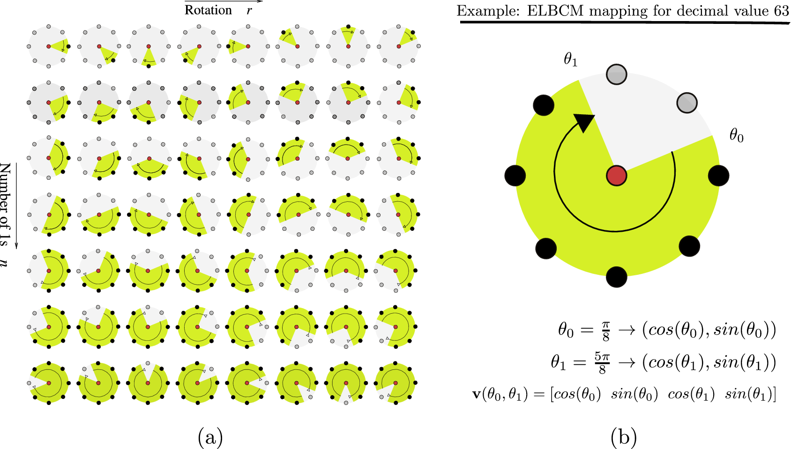

This paper presents a novel way to embed local binary texture information in the form of local binary patterns (LBP) into the covariance descriptor. Contrary to previous publications, our method is not based on the LBP decimal values where arithmetic operations have no texture meaning. Our method uses the angles described by the uniform LBP patterns and includes them into the set of features used to build the covariance descriptor. Our representation is not only more compact but more robust because it is less affected by noise and small neighborhood rotations. Experimental evaluations corroborate the performance of our descriptor for texture analysis and tracking applications. Our descriptor rivals with state-of-the-art methods and beats other covariance-based descriptors.

<ul class="grid effect-2" id="grid">
	<li></li>
	<li></li>
	<li></li>
	<li></li>
</ul>